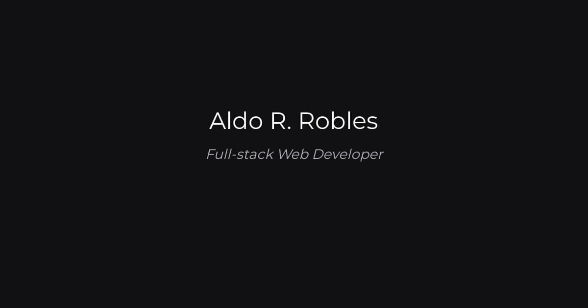

  

---

### Personal Website

Welcome to the repository of my personal website, built with **Astro**, **Tailwind**, and **TypeScript**. 
This project is a reflection of my journey as a developer, showcasing my skills, projects, and the 
technologies I love to work with. The site is hosted on **Cloudflare Pages**, ensuring fast and 
reliable access.

## Features

  

-  [x] Minimal styling
-  [x] Mobile responsive
-  [x] **A** Speed test performance
-  [x] SEO-friendly with canonical URLs and OpenGraph data
-  [x] Sitemap support
-  [x] Markdown & MDX support
-  [x] Syntax highlighting
-  [x] Image optimization
-  [x] Draft mode
-  [x] Copy code block
-  [x] ViewTransition

## Stack

- Astro
- TailwindCSS
- Typescript
- Prettier
- Husky
- Eslint
- Radix Icons
